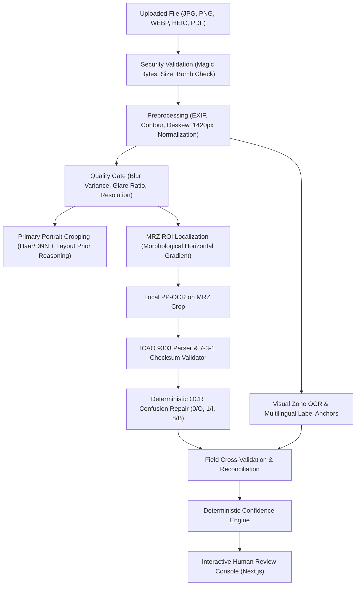

# Local On-Premise Passport Information Extraction & Validation System

A production-grade, privacy-first, on-premise passport identity page extraction and validation system. It operates **100% locally** with zero cloud AI dependencies, zero external telemetry, and zero data leakage.

---

## Key Highlights

- **100% On-Premise & Offline:** Runs completely on your local machine using local ONNX Runtime (`rapidocr-onnxruntime` / PP-OCRv4) and OpenCV. No data, image, MRZ, or portrait is ever transmitted to OpenAI, Anthropic, Google, AWS, or any third party.
- **Worldwide Issuing-State Coverage:** Every ISO 3166-1 alpha-3 code resolves to a readable country name from an offline dataset, plus the ICAO-only codes (German `D`, British national classes `GBD`/`GBN`/`GBO`/`GBP`/`GBS`, `RKS`, UN codes, stateless `XXA` and refugee `XXB`/`XXC` travel documents).
- **Rotation-Agnostic Intake:** All four 90-degree orientations are scored by OCR-B glyph pitch regularity, and the upside-down case is settled by ICAO checksums rather than a heuristic guess — a phone photo taken at any angle still reads.
- **Deterministic ICAO Doc 9303 TD3 Engine:** Full parser for standard 2-line x 44-character passport MRZ zones with repeating 7-3-1 check digit validation, composite checksums, and century-safe date parsing.
- **Checksum-Guided OCR Confusion Repair:** Deterministically resolves ambiguous OCR characters (`0`/`O`, `1`/`I`, `8`/`B`, `5`/`S`, `2`/`Z`) only when allowed by ICAO field grammar and mathematically confirmed by the check digit.
- **Primary Passport Portrait Extraction:** Isolates the authentic holder photo via OpenCV face detection and ICAO geometric layout reasoning while rejecting holograms, watermarks, and miniature ghost thumbnails.
- **Visual Zone & Multilingual Field Extraction:** Extracts visible text using ~340 whole-word field anchors across 30+ Latin-script languages and spatial proximity, preserving authentic accented Unicode characters (e.g. `ÇELİK` vs `CELIK`).
- **Deterministic Cross-Validation & Confidence Engine:** Reconciles visual OCR against checksum-verified MRZ data, generating verifiable confidence scores and actionable "Needs Review" indicators.
- **Image Quality Gate:** Evaluates Laplacian variance (blur), specular highlight ratios (glare), document boundaries, and resolution before extraction, providing immediate actionable guidance.
- **Human-in-the-Loop Review Console:** Next.js (TypeScript / Tailwind CSS) interface featuring split-screen inspection, zoomable canvas with ROI overlays, inline editable fields, raw MRZ breakdown, and JSON export.

---

## System Architecture

```
pasaport/
├── backend/
│   ├── app/
│   │   ├── api/
│   │   │   ├── routes.py                 # FastAPI endpoints (/analyze, /confirm, /sample)
│   │   │   └── sample_generator.py       # Synthetic ICAO test passport generator
│   │   ├── core/
│   │   │   ├── config.py                 # Settings, upload caps, retention policies
│   │   │   ├── logger.py                 # Privacy-safe technical logger (NO PII/MRZ)
│   │   │   └── security.py               # Magic byte validation, decompression bomb guard
│   │   ├── schemas/
│   │   │   └── passport.py               # Strongly-typed Pydantic v2 data models
│   │   ├── services/
│   │   │   ├── ocr_engine.py             # RapidOCR (PP-OCRv4 local ONNX) singleton
│   │   │   └── passport/
│   │   │       ├── preprocessing.py      # EXIF rotation, deskew, perspective warp
│   │   │       ├── quality.py            # Laplacian blur, glare, and resolution gate
│   │   │       ├── mrz_detector.py       # Bottom-zone ROI morphological detector
│   │   │       ├── mrz_ocr.py            # Local OCR on MRZ crops with fallback variants
│   │   │       ├── mrz_parser.py         # ICAO 9303 TD3 parser & date century resolver
│   │   │       ├── mrz_validator.py      # 7-3-1 check digits & composite checksums
│   │   │       ├── mrz_corrector.py      # Checksum-guided deterministic error repair
│   │   │       ├── visual_ocr.py         # Multilingual field extractor with Unicode preservation
│   │   │       ├── portrait_extractor.py # Primary face photo cropper with layout priors
│   │   │       ├── cross_validation.py   # MRZ vs Visual reconciliation & evidence tracking
│   │   │       ├── confidence.py         # Deterministic confidence scoring formula
│   │   │       └── pipeline.py           # Master orchestration pipeline
│   │   └── main.py                       # FastAPI entry point with CORS & security headers
│   ├── tests/                            # Comprehensive Pytest test suite (30 tests)
│   ├── requirements.txt
│   └── Dockerfile
│
├── frontend/
│   ├── src/
│   │   ├── app/                          # Next.js App Router (layout.tsx, page.tsx)
│   │   ├── components/                   # Header, UploadZone, DocumentViewer, FieldReviewTable,
│   │   │                                 # PortraitCard, MRZInspector, QualityBanner, ConfirmationModal
│   │   └── lib/                          # Typed API client and TypeScript interfaces
│   ├── package.json
│   └── Dockerfile
│
├── docker-compose.yml
├── .env.example
└── README.md
```

---

## Step-by-Step Extraction Pipeline



---

## ICAO Doc 9303 TD3 MRZ Verification

The Machine Readable Zone on standard travel documents (TD3) consists of two lines of 44 monospaced characters.

### Check Digit Calculation (Weights 7, 3, 1)
Each character is mapped to an integer value:
- `0`–`9` $\rightarrow$ `0`–`9`
- `A`–`Z` $\rightarrow$ `10`–`35`
- `<` (filler) $\rightarrow$ `0`

The check digit is calculated as:
$$\text{Check Digit} = \left(\sum_{i=0}^{n-1} \text{value}(c_i) \times w_{i \pmod 3}\right) \pmod{10}$$
where $w = [7, 3, 1]$.

### Verified Fields:
1. **Document Number Check Digit:** Line 2, position index `9` (validates positions `0`–`8`).
2. **Date of Birth Check Digit:** Line 2, position index `19` (validates positions `13`–`18`).
3. **Date of Expiry Check Digit:** Line 2, position index `27` (validates positions `21`–`26`).
4. **Composite Check Digit:** Line 2, position index `43` (validates concatenation of document number + check digit + DOB + check digit + expiry + check digit + optional data + check digit).

---

## Local Installation & Quick Start

### Prerequisites
- Python 3.11+ (tested on Python 3.13)
- Node.js 18+ & npm
- Git

### 1. Backend Setup
```powershell
# Navigate to backend
cd backend

# Install dependencies
pip install -r requirements.txt

# Run full test suite (30 tests)
python -m pytest tests -v

# Start FastAPI local server
python -m uvicorn app.main:app --host 127.0.0.1 --port 8000 --reload
```
The backend will be live at `http://127.0.0.1:8000` with documentation at `http://127.0.0.1:8000/docs`.

### 2. Frontend Setup
```powershell
# Open a new terminal in the frontend directory
cd frontend

# Install dependencies
npm install

# Start Next.js development server
npm run dev
```
Open your browser at `http://localhost:3000`.

---

## Running with Docker Compose

To orchestrate the complete local environment in containers:
```bash
docker compose up --build
```
- Frontend: `http://localhost:3000`
- Backend API: `http://localhost:8000`

---

## Privacy & Security Architecture

1. **Zero External Requests:** All OCR models and computer vision pipelines execute purely on local hardware.
2. **Magic Byte Signature Inspection:** Validates raw file headers (`FF D8 FF`, `89 50 4E 47`, `ftypheic`, `%PDF`) to prevent file extension spoofing.
3. **Decompression Bomb Protection:** Hard limit of `45,000,000` pixels via PIL prevents malicious image memory denial-of-service.
4. **Sanitized Technical Logs:** Loggers explicitly omit names, passport numbers, birth dates, MRZ lines, and images. Only request IDs, pipeline stages, durations, and HTTP status codes are recorded.
5. **In-Memory Sessions with Automatic TTL:** Analysis data is retained in local memory for operator review and automatically purged after session expiration.
6. **No Public Upload Directory:** No raw uploaded passport photos are exposed statically via web servers.

---

## Known Limitations

Extraction cannot guarantee complete or correct results for every photo. Unreadable, missing, or conflicting fields require operator review; validate accuracy on representative passport layouts before relying on automated results.

The visual reader scans the full identity page, supports inline labels and values, joins adjacent name fragments within columns, and rejects invalid calendar dates. Fragmented MRZ rows are reassembled before checksum validation. Reconciled visual fallback values populate the response as well as field evidence, and missing visual-only fields trigger review.

1. **Non-Standard Unofficial IDs:** Non-ICAO compliant domestic ID cards that lack Doc 9303 standard MRZ zones will rely exclusively on visual OCR heuristics.
2. **Extreme Physical Damage / Tear:** If the bottom 25% MRZ zone is physically ripped or obscured by opaque tape, checksum validation cannot be performed and operator review is required.
3. **TD1 / TD2 Documents:** Only the TD3 (2 x 44) passport MRZ is parsed. ICAO mandates TD3 for passport booklets worldwide, but TD1 (3 x 30) identity cards and TD2 (2 x 36) passport cards fall back to visual OCR only.
4. **Non-Latin Visual Zones:** The local PP-OCR model reads Latin script. Arabic, Cyrillic, Chinese, Japanese and Korean visual zones rely on the mandatory Latin transliteration line and the MRZ, both of which are always present on ICAO-compliant documents.
5. **Severe Motion Blur:** If image Laplacian variance falls below `35.0`, text characters cannot be reliably resolved and the quality gate will reject the document with actionable guidance.
